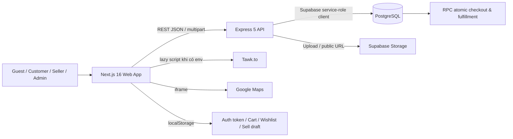
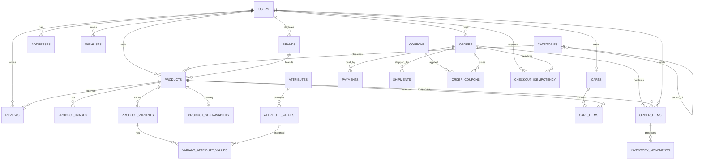
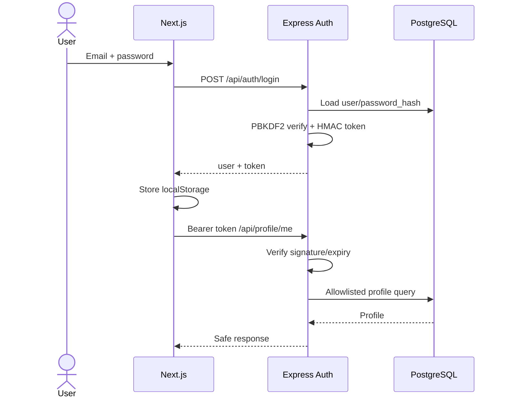
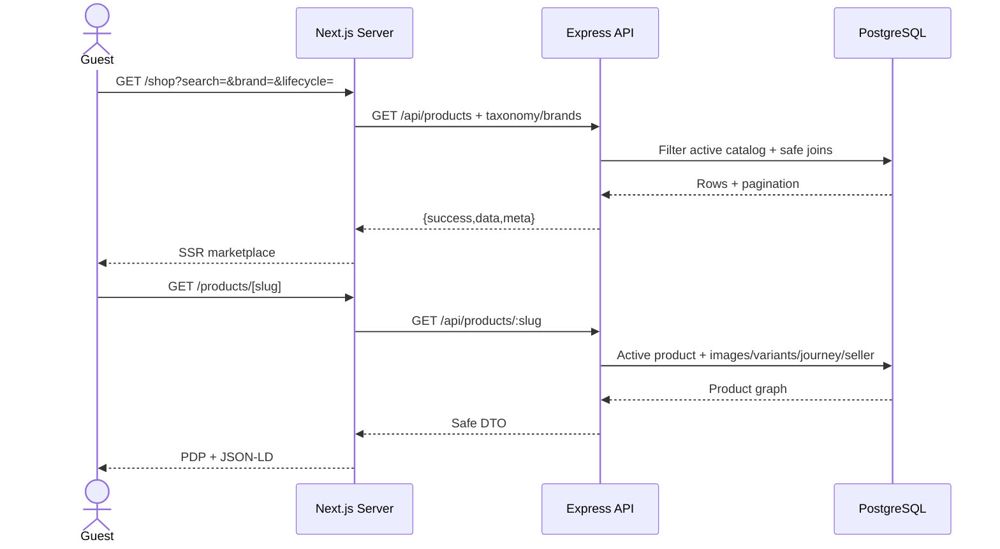
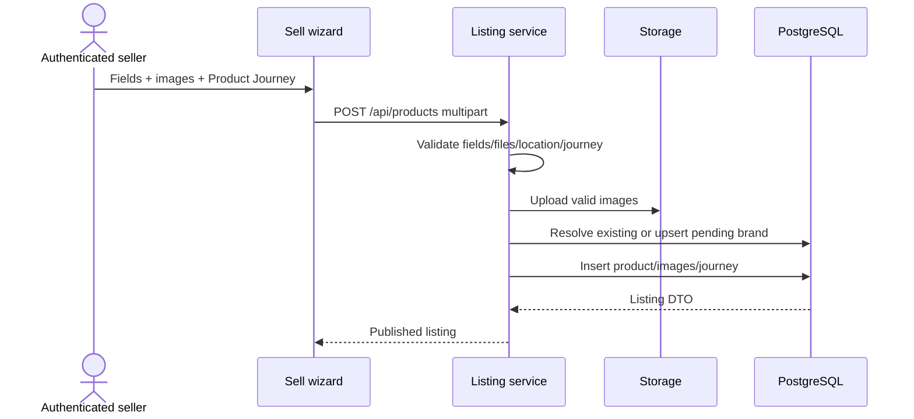
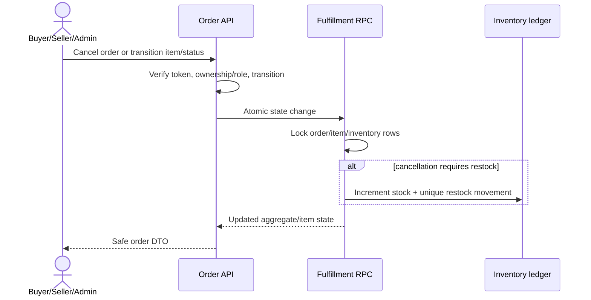

# STYLEHUB WEB — FINAL PROJECT INFORMATION REPORT

> **Ngày lập báo cáo:** 22/07/2026 (Asia/Saigon)<br>
> **Phạm vi bằng chứng:** mã nguồn tại commit `20b81a3bf2da06a8e1c67406e40185b4241a0860`, cấu hình Git, migration, tài liệu trong repository và các kiểm tra chỉ-đọc/an toàn chạy trên môi trường hiện tại.<br>
> **Quy ước trạng thái:** **VERIFIED WORKING** = đã chạy và quan sát đạt; **IMPLEMENTED** = có mã nguồn đầy đủ nhưng chưa tái chạy toàn bộ luồng trong lần kiểm tra này; **PARTIALLY IMPLEMENTED** = đã có một phần nhưng thiếu mắt xích; **PLANNED/NOT IMPLEMENTED** = chưa có luồng vận hành; **BLOCKED FROM VERIFICATION** = không đủ điều kiện xác minh.<br>
> **Lưu ý bảo mật:** báo cáo chỉ nêu tên biến môi trường và loại bí mật; không ghi khóa, mật khẩu, mã quản trị hay token thật.

---

## 1. Thông tin kiểm tra và trạng thái xác minh

| Hạng mục | Trạng thái | Bằng chứng/kết quả |
|---|---|---|
| Git và cấu trúc repository | **VERIFIED WORKING** | Nhánh `main`, HEAD `20b81a3`, đồng bộ `origin/main` (ahead 0/behind 0); kiểm kê trực tiếp bằng Git và `rg`. |
| Cài đặt dependency frontend/backend | **VERIFIED WORKING** | `npm ls --depth=0` đạt trong `frontend` và `backend`; frontend có 2 package WebAssembly ngoại lai (extraneous) nhưng không chặn build. |
| Dependency tại root | **PARTIALLY IMPLEMENTED** | `npm ls --depth=0` lỗi: thiếu `@supabase/ssr` và phiên bản `@supabase/supabase-js` cài tại root không khớp lock/manifest. Hai dependency root không được mã ứng dụng hiện tại sử dụng trực tiếp. |
| ESLint frontend | **VERIFIED WORKING** | `npm run lint` exit code 0. |
| Production build | **VERIFIED WORKING** | `npm run build` với backend đang chạy: Next.js compile, TypeScript, sinh 23 trang thành công; có cảnh báo nhiều lockfile/Turbopack root. |
| Cú pháp backend | **VERIFIED WORKING** | `node --check` trên 53 file `.js`: 53 đạt, 0 lỗi. |
| Catalog live | **VERIFIED WORKING** | `validateCatalog.js`: 148 sản phẩm active, 49 brand được dùng, 4 seller, 20 category được dùng; không có vi phạm toàn vẹn. |
| Sustainability demo data | **VERIFIED WORKING** | `validateSustainabilityDemo.js`: 25/25 kiểm tra đạt, không tạo dữ liệu mới. |
| API public | **VERIFIED WORKING** | `/`, health, products, categories, shop-filter brands, sustainability impact đều HTTP 200. |
| Responsive smoke test | **VERIFIED WORKING** | Playwright production mode tại 390×844, 768×1024, 1440×900 trên `/`, `/shop`, `/sustainability`: HTTP 200, có `main`/navigation, không overflow ngang, 0 console error. |
| Luồng có ghi dữ liệu (register/checkout/sell/cancel) | **BLOCKED FROM VERIFICATION** | Không tái chạy trong phiên này vì yêu cầu bảo toàn dữ liệu; repository có các suite chuyên biệt và tài liệu kết quả lịch sử. |
| URL production công khai | **BLOCKED FROM VERIFICATION** | Không tìm thấy cấu hình deploy/CI deploy hay URL production xác nhận được trong repository. |

Nguồn chính: [`package.json`](package.json), [`frontend/package.json`](frontend/package.json), [`backend/package.json`](backend/package.json), [`backend/server.js`](backend/server.js), [`supabase/migrations`](supabase/migrations), [`docs/final-report-evidence-map.md`](docs/final-report-evidence-map.md).

## 2. Tổng quan dự án StyleHub

StyleHub là sàn thương mại điện tử thời trang C2C, cho phép người dùng vừa mua vừa đăng bán sản phẩm. Điểm khác biệt là **Product Journey** và **Circular Impact**: người bán tự khai báo vòng đời sản phẩm (`new`, `deadstock`, `pre_loved`, `repaired`, `upcycled`, `not_specified`), hệ thống lưu snapshot khi checkout và tổng hợp số đơn vị circular đã hoàn tất.

Hệ thống là monorepo gồm Next.js frontend, Express API và Supabase PostgreSQL/Storage. Catalog hiện có 148 sản phẩm seed active; người dùng có thể tạo listing thật, quản lý kho/đơn hàng và xem storefront công khai. Sustainability được trình bày thận trọng: số liệu là hoạt động ghi nhận trên StyleHub, không phải phép đo CO₂, nước hay chất thải tránh được.

## 3. Bài toán và lý do chọn đề tài

- Thị trường thời trang đã qua sử dụng và hàng local/global phân tán, khó tìm kiếm theo catalog thống nhất.
- Người bán cá nhân cần quy trình đăng sản phẩm, quản lý tồn và thực hiện đơn hàng đủ đơn giản.
- Người mua cần catalog, tìm kiếm, giỏ hàng, checkout và lịch sử đơn hàng trong một trải nghiệm nhất quán.
- Các tuyên bố “bền vững” dễ bị phóng đại; dự án chọn mô hình seller-declared và công khai phương pháp tính để tăng tính minh bạch.
- Đề tài bao phủ kiến thức full-stack phù hợp Final Project: SSR/CSR, REST API, auth, upload, PostgreSQL/RLS, giao dịch nguyên tử, responsive UI, kiểm thử và deployment readiness.

Đây là diễn giải phân tích từ chức năng hiện hữu và [`docs/circular-impact-methodology.md`](docs/circular-impact-methodology.md), không phải khảo sát thị trường định lượng.

## 4. Mục tiêu tổng quát

Xây dựng một nền tảng C2C fashion marketplace có thể trình diễn end-to-end, trong đó catalog công khai, tài khoản, đăng bán, checkout, quản lý đơn và sustainability ledger hoạt động trên dữ liệu PostgreSQL thật; đồng thời bảo đảm thông tin vòng đời không được diễn đạt như chứng nhận môi trường độc lập.

## 5. Mục tiêu cụ thể

1. Cung cấp catalog có category, brand, seller, biến thể, giá khuyến mại và tìm kiếm/lọc/sắp xếp.
2. Hỗ trợ đăng ký, đăng nhập và profile với ba role dữ liệu: customer, seller, admin.
3. Cho phép người dùng đăng listing nhiều bước, upload ảnh và quản lý listing của mình.
4. Thực hiện checkout nguyên tử, idempotent, trừ/hoàn tồn đúng một lần.
5. Hỗ trợ order history, buyer cancellation, seller fulfillment và admin order status.
6. Lưu Product Journey, snapshot lịch sử và tính Circular Impact theo scope public/private.
7. Tạo giao diện responsive, metadata SEO, sitemap và robots.
8. Cung cấp migration, seed/validator, test suite và tài liệu deployment đủ để bảo vệ Final Project.

## 6. Đối tượng sử dụng

| Đối tượng | Nhu cầu chính | Mức hỗ trợ hiện tại |
|---|---|---|
| Guest | Xem catalog, search/filter, PDP, seller storefront, sustainability; dùng cart/wishlist cục bộ | **VERIFIED WORKING** cho luồng public chính |
| Customer | Profile, checkout, lịch sử/hủy đơn, impact cá nhân | **IMPLEMENTED**; private write flows không tái chạy phiên này |
| Seller | Đăng/chỉnh sửa listing, quản lý ảnh/trạng thái, fulfillment, storefront, impact | **IMPLEMENTED** |
| Admin | Xem toàn bộ đơn và chuyển trạng thái aggregate order | **IMPLEMENTED** |
| Giảng viên/người chấm | Đánh giá kiến trúc, traceability, dữ liệu thật và bằng chứng test | **IMPLEMENTED** qua code/docs/report này |

## 7. Phạm vi dự án

Trong phạm vi:

- C2C fashion catalog và discovery.
- Custom account authentication, profile/avatar.
- Local cart/wishlist; checkout COD hoặc bank transfer.
- Seller listing lifecycle, images, inventory và seller-declared brand.
- Buyer/seller/admin order workflow.
- Product Journey, immutable order snapshots và Circular Impact.
- Supabase PostgreSQL, RLS/grants, Storage.
- Responsive web, SEO cơ bản, contact/map và conditional live-chat widget.

Phạm vi học thuật hiện tại là một bản demo giàu chức năng, chưa phải marketplace production có vận hành, đối soát và tuân thủ pháp lý đầy đủ.

## 8. Các chức năng ngoài phạm vi

- Cổng thanh toán trực tuyến, webhook, hoàn tiền/đối soát.
- Đơn vị vận chuyển, tracking thời gian thực, tính phí theo địa chỉ.
- Chat buyer–seller thật; nút chat trên PDP hiện là placeholder.
- Review CRUD hoàn chỉnh và moderation review.
- Đồng bộ cart/wishlist đa thiết bị.
- Forgot password, email verification, MFA, OAuth/social login.
- Admin moderation cho seller-declared brand/listing/user.
- Variant authoring trong seller UI.
- Chứng nhận độc lập về vật liệu/vòng đời hoặc quy đổi CO₂/nước/rác thải.
- Mobile app native, đa tiền tệ/đa ngôn ngữ, recommendation engine.

## 9. Công nghệ sử dụng

| Lớp | Công nghệ xác minh từ manifest/code | Vai trò |
|---|---|---|
| Frontend | Next.js `16.2.9`, React `19.2.4`, TypeScript `5.9.3` | App Router, Server/Client Components, route metadata |
| Styling | Tailwind CSS `4.3.2`, CSS variables, `next/font` Inter + Archivo | Responsive UI và design tokens cơ bản |
| Backend | Node.js, Express `5.2.1`, CommonJS | REST API, validation, auth, business services |
| Database/API client | Supabase JS `2.110.0`, PostgreSQL/PostgREST/RPC | Persistence, query, transaction RPC |
| Storage | Supabase Storage | Bucket public `product-images`, `avatars` |
| Auth/crypto | Node `crypto`: PBKDF2-SHA256 + HMAC-SHA256 token | Custom authentication; không dùng Supabase Auth session |
| Upload | Multer `2.2.0` memory storage | Upload ảnh listing/avatar |
| QA | ESLint 9, Next build/TypeScript, Node integration scripts, Python Playwright | Static, integration và E2E testing |
| Dịch vụ ngoài | Tawk.to script tùy biến môi trường; Google Maps iframe | Support chat và map contact |

Môi trường chạy kiểm tra: Node `v24.12.0`, npm `11.6.2`. Project chưa khai báo `engines`; README root vẫn ghi Next.js 14 và README frontend còn nội dung create-next-app/Geist, nên tài liệu này ưu tiên manifest thực tế.

## 10. Cấu trúc thư mục dự án

```text
72ITIS30503_Team4_Project/
├─ frontend/                 # Next.js app, components, hooks, lib, public assets, Playwright suites
├─ backend/                  # Express routes/controllers/services/middleware, validators và test scripts
├─ supabase/
│  ├─ migrations/           # 22 migration đang hoạt động
│  ├─ archived_migrations_not_applied/ # migration lưu trữ, không thuộc chuỗi active
│  └─ seed.sql
├─ docs/                     # QA, evidence map, deployment, sustainability methodology
├─ package.json              # script điều phối frontend/backend
├─ .env.example              # tên biến môi trường public/server mẫu
└─ README.md
```

Các thư mục `.agents`, `.claude`, `.impeccable`, `.superdesign` là metadata/tooling hỗ trợ và không thuộc runtime sản phẩm. `node_modules`, `.next`, file `.env`, ảnh test và các script introspection được ignore.

## 11. Kiến trúc tổng thể



Kiến trúc phân tầng backend là `route → middleware → controller → service → Supabase`. Frontend kết hợp SSR cho catalog/public SEO với CSR cho auth/private/local interaction. Không có ORM; service query trực tiếp Supabase.

## 12. Luồng giao tiếp giữa Frontend, Backend và Database

1. Public Server Component gọi `NEXT_PUBLIC_API_URL` để lấy sản phẩm/category/brand/seller; sản phẩm dùng `cache: no-store`, một số taxonomy dùng revalidate.
2. Client Component gọi cùng Express API bằng `fetch`; token custom được lấy từ localStorage và gửi `Authorization: Bearer ...`.
3. Express xác thực token, chuẩn hóa/validate payload, áp ownership/role cần thiết rồi gọi service.
4. Service dùng Supabase anon client cho public path hoặc service-role client cho trusted writes/private reads.
5. Checkout và fulfillment quan trọng gọi PostgreSQL RPC để khóa row, cập nhật tồn, ledger và snapshot trong một transaction.
6. Express trả envelope thống nhất `{ success, data, meta? }` hoặc `{ success:false, error:{message, code?, details?} }`.

Điểm cần lưu ý: [`frontend/lib/supabase.ts`](frontend/lib/supabase.ts) tạo public client nhưng luồng ứng dụng hiện tại chủ yếu đi qua Express. Các policy dựa trên Supabase `auth.uid()` không cấp identity cho token custom.

## 13. Các vai trò người dùng

- **Guest:** không có token; truy cập tài nguyên public, cart/wishlist localStorage.
- **Customer:** role text `customer`; mua hàng và có thể dùng mọi endpoint listing vì backend chưa có seller-only guard.
- **Seller:** role text `seller`; có cùng quyền API listing như mọi tài khoản authenticated, cộng ngữ nghĩa UI/dashboard.
- **Admin:** role text `admin`; ngoài quyền authenticated còn qua `requireAdmin` để quản trị order.

Schema còn dấu vết mô hình `roles`/`role_id` và `auth.users`, trong khi auth service hiện hành đọc/ghi `users.role` và `password_hash`. Đây là dấu hiệu drift giữa schema nền và migration lab lưu trữ.

## 14. Ma trận phân quyền

| Chức năng | Guest | Customer | Seller | Admin | Kiểm soát thực tế |
|---|:---:|:---:|:---:|:---:|---|
| Xem catalog/PDP/category/seller/sustainability | ✓ | ✓ | ✓ | ✓ | Public API |
| Cart/wishlist trên thiết bị | ✓ | ✓ | ✓ | ✓ | localStorage, không server authorization |
| Checkout/xem-hủy đơn của mình/profile | — | ✓ | ✓ | ✓ | `requireAuth` + ownership; admin có quyền mở rộng ở order detail/cancel |
| Tạo/sửa listing của mình | — | ✓ | ✓ | ✓ | `requireAuth` + `seller_id`; **không kiểm tra role seller** |
| Seller dashboard/fulfillment item của mình | — | ✓ | ✓ | ✓ | Client auth gate + service ownership; **không kiểm tra role seller** |
| Xem toàn bộ order/chuyển aggregate status | — | — | — | ✓ | `requireAdmin` |
| Duyệt/reject brand | — | — | — | — | **PLANNED/NOT IMPLEMENTED** |

Kết luận: authorization theo ownership khá rõ ở listing/order, nhưng role “seller” hiện mang tính phân loại UX hơn là ranh giới quyền backend.

## 15. Danh sách yêu cầu chức năng

| ID | Yêu cầu | Trạng thái | Bằng chứng |
|---|---|---|---|
| FR-01 | Trang chủ và catalog động | **VERIFIED WORKING** | [`frontend/app/page.tsx`](frontend/app/page.tsx), browser smoke |
| FR-02 | Shop search/filter/sort/pagination | **IMPLEMENTED** | [`frontend/app/shop/page.tsx`](frontend/app/shop/page.tsx), [`backend/services/productService.js`](backend/services/productService.js) |
| FR-03 | Category navigation và page | **IMPLEMENTED** | `/category/[slug]`, category service |
| FR-04 | Product detail/variant/journey | **IMPLEMENTED** | `/products/[slug]`, `ProductJourneyDetails` |
| FR-05 | Public seller storefront/impact | **IMPLEMENTED** | `/seller/[username]`, seller/impact service |
| FR-06 | Đăng ký/đăng nhập/logout/session | **IMPLEMENTED** | auth routes/service/middleware |
| FR-07 | Profile, avatar, private impact | **IMPLEMENTED** | `/profile`, profile service |
| FR-08 | Local cart và quantity | **IMPLEMENTED** | `CartProvider`, `/cart` |
| FR-09 | Local wishlist | **IMPLEMENTED** | `WishlistProvider`, `/wishlist` |
| FR-10 | Checkout preview/coupon/create | **IMPLEMENTED** | `/checkout`, order service, atomic RPC |
| FR-11 | Idempotency và authoritative quote | **IMPLEMENTED** | `Idempotency-Key`, checkout tables/RPC |
| FR-12 | Order history/detail/cancel | **IMPLEMENTED** | `/orders`, order routes/service |
| FR-13 | Đăng listing nhiều bước + upload ảnh | **IMPLEMENTED** | `/sell`, listing service |
| FR-14 | Seller dashboard, edit/status/images | **IMPLEMENTED** | `/seller/dashboard`, seller listing endpoints |
| FR-15 | Seller fulfillment từng order item | **IMPLEMENTED** | seller order service/RPC |
| FR-16 | Admin order management | **IMPLEMENTED** | `/admin/orders`, admin endpoints |
| FR-17 | Seller-declared brand provenance | **IMPLEMENTED** | brand service, migration `20260724000000` |
| FR-18 | Product Journey và Circular discovery | **VERIFIED WORKING** | 25/25 sustainability validator; lifecycle UI/API |
| FR-19 | Platform/seller/buyer impact metrics | **VERIFIED WORKING** | public API probe và impact service |
| FR-20 | Review CRUD | **PARTIALLY IMPLEMENTED** | schema + seller rating aggregate; không có review write API/UI |
| FR-21 | Server cart/wishlist persistence | **PARTIALLY IMPLEMENTED** | schema có; cart API placeholder, UI dùng localStorage |
| FR-22 | Payment/ship tracking | **PLANNED/NOT IMPLEMENTED** | schema có payments/shipments; runtime chưa tích hợp |
| FR-23 | Contact/map/Tawk.to support | **PARTIALLY IMPLEMENTED** | map iframe; form giả lập; widget phụ thuộc env |
| FR-24 | SEO metadata/sitemap/robots | **VERIFIED WORKING** | production build route table |

## 16. Danh sách yêu cầu phi chức năng

| ID | Yêu cầu | Đánh giá | Ghi chú |
|---|---|---|---|
| NFR-01 | Responsive | **VERIFIED WORKING** | 3 viewport × 3 route smoke đạt; chưa phải ma trận toàn site |
| NFR-02 | Accessibility cơ bản | **PARTIALLY IMPLEMENTED** | landmark, label, focus style, reduced-motion có; chưa chạy axe/screen-reader |
| NFR-03 | Hiệu năng | **PARTIALLY IMPLEMENTED** | SSR, lazy images/script; raw `` thay vì Next Image, API no-store nhiều |
| NFR-04 | SEO | **IMPLEMENTED** | metadata, JSON-LD, sitemap, robots, semantic headings |
| NFR-05 | Bảo mật | **PARTIALLY IMPLEMENTED** | hashing/signature/ownership/RLS tốt; localStorage token, permissive CORS, no rate limit |
| NFR-06 | Toàn vẹn giao dịch | **IMPLEMENTED** | atomic checkout, idempotency, inventory ledger/snapshot |
| NFR-07 | Maintainability | **PARTIALLY IMPLEMENTED** | phân tầng rõ; validation thủ công, schema drift, docs version drift |
| NFR-08 | Observability | **PARTIALLY IMPLEMENTED** | health endpoint và console logs; chưa có structured logging/APM/alert |
| NFR-09 | Testability | **PARTIALLY IMPLEMENTED** | nhiều suite chuyên biệt; thiếu test runner/script thống nhất và CI |
| NFR-10 | Deployability | **PARTIALLY IMPLEMENTED** | build đạt, có checklist/guide; không có IaC/CI deploy/public URL |
| NFR-11 | Privacy | **PARTIALLY IMPLEMENTED** | API public allowlist; privacy policy mô tả auth/RLS chưa khớp implementation |
| NFR-12 | Khả năng mở rộng | **PARTIALLY IMPLEMENTED** | stateless API và DB transaction tốt; local state, in-memory dedupe và full brand list giới hạn scale |

## 17. Danh sách toàn bộ Frontend routes

| Route | Render/bảo vệ | Chức năng | Trạng thái |
|---|---|---|---|
| `/` | Dynamic SSR | Home, latest/on-sale, circular impact | **VERIFIED WORKING** |
| `/about` | Static | Giới thiệu | **IMPLEMENTED** |
| `/admin/orders` | Static shell + client admin gate | Quản trị order | **IMPLEMENTED** |
| `/cart` | Client/localStorage | Giỏ hàng | **IMPLEMENTED** |
| `/category/[slug]` | Dynamic SSR | Danh mục | **IMPLEMENTED** |
| `/checkout` | Client auth gate | Checkout | **IMPLEMENTED** |
| `/checkout/success?orderId=…` | Dynamic/client auth | Xác nhận order thuộc user | **IMPLEMENTED** |
| `/contact` | Static + client form | Liên hệ, Google Maps | **PARTIALLY IMPLEMENTED** |
| `/delivery-terms` | Static | Điều khoản giao hàng | **IMPLEMENTED** |
| `/login` | Static + Suspense client form | Đăng nhập | **IMPLEMENTED** |
| `/orders` | Client auth gate | Lịch sử và hủy đơn | **IMPLEMENTED** |
| `/privacy-policy` | Static | Chính sách riêng tư | **PARTIALLY IMPLEMENTED** do copy lệch auth thực tế |
| `/products` | Temporary redirect | Chuyển tới `/shop` | **IMPLEMENTED** |
| `/products/[slug]` | Dynamic SSR | Product detail | **IMPLEMENTED** |
| `/profile` | Client auth gate | Profile/avatar/impact | **IMPLEMENTED** |
| `/register` | Static/client | Đăng ký role customer/seller/admin | **IMPLEMENTED** nhưng có rủi ro admin code |
| `/robots.txt` | Static metadata route | Crawl rules | **VERIFIED WORKING** |
| `/sell` | Client auth gate | Wizard đăng listing | **IMPLEMENTED** |
| `/seller/[username]` | Dynamic SSR | Storefront công khai | **IMPLEMENTED** |
| `/seller/dashboard` | Client auth gate | Overview/listings/orders | **IMPLEMENTED** |
| `/shop` | Dynamic SSR + client filters | Marketplace | **VERIFIED WORKING** |
| `/sitemap.xml` | Dynamic metadata route | Static + product/category/seller URLs | **VERIFIED WORKING** |
| `/sustainability` | Static + client impact panel | Methodology/impact | **VERIFIED WORKING** |
| `/wishlist` | Client/localStorage | Danh sách yêu thích | **IMPLEMENTED** |
| `/_not-found` | Static | 404 toàn cục | **VERIFIED WORKING** qua build |

Không có `middleware.ts`; private page protection được thực hiện ở client, còn dữ liệu thật phải được backend kiểm tra. `robots.txt` không phải cơ chế bảo mật.

## 18. Phân tích giao diện và component

### Design system và nhận diện

- Phong cách monochrome editorial/streetwear: nền trắng, chữ gần đen, border trung tính, CTA đen/trắng; accent đỏ cho sale, xanh cho success, vàng/amber cho trạng thái chờ/cảnh báo.
- Typography: Inter cho nội dung, Archivo cho display, nhiều eyebrow uppercase/letter-spacing; tạo cá tính nhưng chữ 9–11px có nguy cơ khó đọc.
- Header sticky gồm ticker, logo, desktop mega menu, auth/wishlist/cart/sell; mobile dùng nav cuộn ngang, chưa có hamburger/drawer.
- Product cards bo góc 16px; các panel khác dùng border vuông/hard shadow, khiến vocabulary hình khối chưa hoàn toàn nhất quán.

### Component và state

- Layout toàn cục: `Header`, `Footer`, `AuthProvider`, `CartProvider`, `WishlistProvider`, conditional `TawkToWidget`.
- Home: `Hero`, `TrustStrip`, `CategorySpotlight`, `CircularImpactSection`, `ProductRow`, `SellerCTA`.
- Commerce: `ProductCard`, gallery/actions/journey, `ShopFilters`, pagination, checkout client.
- Seller: multi-step `SellListingClient`, `ProductJourneyFields`, dashboard tabs/forms/tables.
- State toàn cục dùng React Context + localStorage; không có Redux/Zustand.
- Server Components phù hợp SEO/public catalog; Client Components xử lý auth, form, storage và mutation.

### Điểm UX cần chỉnh

- Copy “Verified sellers/Condition checked” chưa có quy trình verification tương ứng; seller API trả `is_verified_seller:false`.
- CTA circular tạo query nhiều lifecycle phân tách bằng dấu phẩy, trong khi backend chỉ nhận một enum; có khả năng trả 400.
- Condition filter UI dùng `new/like_new/used`, trong khi listing hiện dùng `new_with_tags/like_new/excellent/good/fair`; filter exact-match có thể bỏ sót.
- Contact form chỉ hiển thị success giả lập; “Chat with seller” dùng alert placeholder.
- Touch target/icon nhỏ và màu `neutral-400` trên trắng cần audit contrast/touch chuyên sâu.

Đánh giá giao diện này áp dụng tổng hợp rubric `impeccable`, định hướng `frontend-design` và kiểm tra consistency theo `superdesign`; không tạo artifact thiết kế mới để tuân thủ yêu cầu chỉ tạo một file báo cáo.

## 19. Responsive design

UI dùng Tailwind mobile-first (`sm`, `md`, `lg`, `xl`): grid sản phẩm 1→2→4 cột, PDP 1→2 cột, checkout chuyển sang 12 cột tại desktop, table có `overflow-x-auto`, seller dashboard có card mobile và table desktop. CSS toàn cục hỗ trợ `prefers-reduced-motion`.

Xác minh thực tế:

| Viewport | Routes | Kết quả |
|---|---|---|
| 390×844 | `/`, `/shop`, `/sustainability` | HTTP 200, body đúng 390px, không overflow, 0 console error |
| 768×1024 | tương tự | HTTP 200, body đúng 768px, không overflow, 0 console error |
| 1440×900 | tương tự | HTTP 200, body đúng 1440px, không overflow, 0 console error |

Giới hạn: đây là smoke test ba route đại diện, chưa xác nhận bằng thiết bị thật, screen reader, zoom 200%, landscape, nội dung cực dài hoặc toàn bộ authenticated flows.

## 20. Danh sách toàn bộ API endpoints

| Method | Endpoint | Auth | Mục đích/trạng thái |
|---|---|---|---|
| GET | `/` | Public | Service banner — **VERIFIED WORKING** |
| GET | `/api/health` | Public | Health/config flag — **VERIFIED WORKING** |
| POST | `/api/auth/register` | Public | Đăng ký — **IMPLEMENTED** |
| POST | `/api/auth/login` | Public | Đăng nhập — **IMPLEMENTED** |
| GET | `/api/auth/me` | Required | Session user — **IMPLEMENTED** |
| POST | `/api/auth/logout` | Public | Stateless acknowledgement — **PARTIALLY IMPLEMENTED** |
| POST | `/api/products` | Required, multipart | Tạo listing — **IMPLEMENTED** |
| GET | `/api/products` | Public | List/filter/sort/paginate — **VERIFIED WORKING** |
| GET | `/api/products/featured` | Public | Sản phẩm nổi bật — **IMPLEMENTED** |
| GET | `/api/products/:slug` | Public | PDP active product — **IMPLEMENTED** |
| GET | `/api/categories` | Public | Danh sách category — **VERIFIED WORKING** |
| GET | `/api/categories/tree` | Public | Cây category — **IMPLEMENTED** |
| GET | `/api/categories/:slug` | Public | Category detail — **IMPLEMENTED** |
| GET | `/api/categories/:slug/products` | Public | Products by category — **IMPLEMENTED** |
| GET | `/api/brands` | Public | Brands; `scope=shop-filter` — **VERIFIED WORKING** |
| GET | `/api/cart` | Public | Placeholder — **PLANNED/NOT IMPLEMENTED** |
| POST | `/api/cart` | Public | Placeholder — **PLANNED/NOT IMPLEMENTED** |
| GET | `/api/profile/me/impact` | Required | Private impact — **IMPLEMENTED** |
| GET | `/api/profile/me` | Required | Profile — **IMPLEMENTED** |
| PATCH | `/api/profile/me` | Required | Update allowlisted profile — **IMPLEMENTED** |
| POST | `/api/profile/me/avatar` | Required, multipart | Upload avatar — **IMPLEMENTED** |
| GET | `/api/sellers/:username/impact` | Public | Public seller impact — **IMPLEMENTED** |
| GET | `/api/sellers/:username` | Public | Seller profile/rating — **IMPLEMENTED** |
| GET | `/api/sellers/:username/products` | Public | Active seller products — **IMPLEMENTED** |
| GET | `/api/seller/listings` | Required | My listings — **IMPLEMENTED** |
| GET | `/api/seller/listings/stats` | Required | Seller stats — **IMPLEMENTED** |
| GET | `/api/seller/listings/:id` | Required/owner | Listing detail — **IMPLEMENTED** |
| PATCH | `/api/seller/listings/:id` | Required/owner | Optimistic edit — **IMPLEMENTED** |
| POST | `/api/seller/listings/:id/status` | Required/owner | Status transition — **IMPLEMENTED** |
| POST | `/api/seller/listings/:id/images` | Required/owner | Add images — **IMPLEMENTED** |
| PATCH | `/api/seller/listings/:id/images/reorder` | Required/owner | Reorder images — **IMPLEMENTED** |
| DELETE | `/api/seller/listings/:id/images/:imageId` | Required/owner | Delete image — **IMPLEMENTED** |
| GET | `/api/seller/orders` | Required/seller scope | Seller items — **IMPLEMENTED** |
| GET | `/api/seller/orders/:id` | Required/seller scope | Seller order detail — **IMPLEMENTED** |
| PATCH | `/api/seller/orders/items/:itemId/fulfillment` | Required/seller scope | Fulfillment transition — **IMPLEMENTED** |
| POST | `/api/orders` | Required | Atomic checkout — **IMPLEMENTED** |
| POST | `/api/orders/preview` | Required | Authoritative quote — **IMPLEMENTED** |
| POST | `/api/orders/validate-coupon` | Required | Coupon validation — **IMPLEMENTED** |
| GET | `/api/orders/my` | Required | Buyer order list — **IMPLEMENTED** |
| GET | `/api/orders` | Admin | All orders — **IMPLEMENTED** |
| GET | `/api/orders/:id` | Owner/Admin | Order detail — **IMPLEMENTED** |
| POST | `/api/orders/:id/cancel` | Owner/Admin | Atomic cancel/restock — **IMPLEMENTED** |
| PATCH | `/api/orders/:id/status` | Admin | Aggregate status transition — **IMPLEMENTED** |
| GET | `/api/sustainability/impact` | Public | Platform impact — **VERIFIED WORKING** |

API không có endpoint wishlist/review/payment/shipment/chat. `/api/cart` là placeholder, không phải server cart thật.

## 21. Kiến trúc Backend

[`backend/server.js`](backend/server.js) tải `backend/.env` rồi root `.env`, cấu hình `cors()`, JSON body, đăng ký route, 404 và global error handler. Cấu trúc chính:

```text
routes/* → middleware/auth.js → controllers/* → services/*
                                      ├─ lib/supabase.js
                                      ├─ constants/*
                                      └─ PostgreSQL tables/RPC/Storage
```

- **Routes** định nghĩa method/path, auth middleware và Multer.
- **Controllers** chuyển request thành tham số service và chuẩn hóa response.
- **Services** chứa business rules, allowlist, ownership, query và mapping response.
- **Constants** tập trung enum sustainability, location Việt Nam, listing/order state.
- **Supabase clients** tách public/anon và admin/service-role; service-role là trust boundary quan trọng.
- Server khởi động ngay khi import, chưa export `app`; integration test vì vậy chủ yếu khởi động process và gọi HTTP.
- Logging hiện là `console`; chưa có request ID, structured logger, metrics hay centralized error monitoring.

## 22. Cơ chế validation và error handling

Validation được viết thủ công, không dùng Zod/Joi/express-validator. Các nhóm đáng chú ý:

- Auth: email normalization, password hashing PBKDF2, role allowlist/admin code.
- Checkout: tên ≥2, email pattern, số điện thoại Việt Nam `0` + 9 chữ số, địa chỉ/province/district/street, phương thức `cod|bank_transfer`, item và coupon.
- Listing: tên 3–120, mô tả 10–2000, condition enum, size ≤40 và shoe size EU, giá dương ≤500 triệu, sale price nhỏ hơn giá, stock create 1–9999, location Việt Nam.
- Upload: JPEG/PNG/WebP, tối đa 6 ảnh, 5MB/ảnh; Multer memory storage.
- Sustainability: lifecycle enum, giới hạn độ dài text, boolean reuse packaging, claim source server-controlled.
- Brand: NFC, trim/collapse whitespace, comparison case-insensitive; reject control chars, HTML, URL/email-only, symbols-only và >60 ký tự.
- Optimistic concurrency: listing edit có `expected_updated_at`, conflict trả 409.

Response error thường có `message`, `code`, `details`; HTTP 400/401/403/404/409/422/500/503 được dùng theo tình huống. Điểm yếu: một số route category/product/seller chuyển `err.message` vào `details`, có thể lộ nội dung nội bộ; global error log raw object. Validation phân tán dễ lệch enum, và đã xuất hiện mismatch condition/lifecycle query giữa UI với backend.

## 23. Thiết kế cơ sở dữ liệu

Database là PostgreSQL trên Supabase. Repository có 22 migration active, seed và một thư mục `archived_migrations_not_applied`. Mô hình gồm:

- Catalog: categories, brands, products, images, variants, attributes.
- Identity/profile: users, roles, addresses.
- Commerce: carts, wishlists, orders, order items, payments, shipments, coupons.
- Reliability: checkout idempotency, inventory movements, RPC transaction.
- Trust/sustainability: reviews, product sustainability, immutable order-item snapshots.

RLS được bật rộng; public chỉ đọc catalog active/published. Các bảng private/RPC quan trọng khóa với anon/authenticated và chỉ backend service-role được sử dụng. Tuy vậy custom auth không tạo Supabase session, nên policy dựa `auth.uid()` là legacy/không tham gia luồng backend hiện hành.

**Rủi ro tái dựng nghiêm trọng:** các migration active đầu tiên tạo `users/orders/order_items` theo schema nền (`role_id`, `auth_user_id`, `order_number`, `total`...), trong khi auth/order service và atomic RPC hiện dùng shape khác (`password_hash`, `role`, `order_code`, `total_amount`, snapshot...). Migration tạo shape Lab tương ứng nằm trong `archived_migrations_not_applied`. Live DB đang hoạt động, nhưng fresh apply chỉ chuỗi active chưa được chứng minh và có khả năng lỗi/khác schema runtime.

## 24. Data dictionary

| Bảng | Khóa/quan hệ chính | Dữ liệu/chức năng | Runtime hiện tại |
|---|---|---|---|
| `roles` | PK `id` | Danh mục role legacy | **PARTIALLY IMPLEMENTED** |
| `users` | PK `id`; unique email/username; legacy FK auth/role | Identity, password hash, role, profile | **IMPLEMENTED**, schema drift cần xử lý |
| `addresses` | FK user | Địa chỉ người dùng | **PLANNED/NOT IMPLEMENTED** trong UI |
| `categories` | self-FK parent; unique slug | Taxonomy, order, image, active | **VERIFIED WORKING** |
| `brands` | unique name/slug; FK created_by | Catalog/seller-declared provenance | **VERIFIED WORKING** |
| `products` | FK category/brand/seller; unique slug | Listing, price, stock, status, condition, source | **VERIFIED WORKING** |
| `product_images` | FK product; unique product+URL | Gallery, primary, sort order | **IMPLEMENTED** |
| `product_variants` | FK product; unique SKU | Variant price/stock/status | **PARTIALLY IMPLEMENTED** |
| `attributes` | PK id | Loại thuộc tính | **PARTIALLY IMPLEMENTED** |
| `attribute_values` | FK attribute | Giá trị thuộc tính | **PARTIALLY IMPLEMENTED** |
| `variant_attribute_values` | FK variant/value | N–N variant–attribute value | **PARTIALLY IMPLEMENTED** |
| `carts` | FK user; unique active cart/user | Server cart | **PLANNED/NOT IMPLEMENTED** |
| `cart_items` | FK cart/product/variant | Server cart lines | **PLANNED/NOT IMPLEMENTED** |
| `wishlists` | FK user/product; unique pair | Server wishlist | **PLANNED/NOT IMPLEMENTED** |
| `orders` | FK buyer; unique order code | Customer/shipping/payment totals/status | **IMPLEMENTED**, migration drift |
| `order_items` | FK order/product/variant/seller | Immutable product/lifecycle snapshots, fulfillment | **IMPLEMENTED** |
| `payments` | FK order | Payment records/status | **PLANNED/NOT IMPLEMENTED** |
| `shipments` | FK order | Shipping/tracking records | **PLANNED/NOT IMPLEMENTED** |
| `reviews` | FK user/product/order_item; unique user+product | Rating/content/moderation | **PARTIALLY IMPLEMENTED** (read aggregate only) |
| `coupons` | code/validity/limits | Discount rule | **IMPLEMENTED** |
| `order_coupons` | FK order/coupon | Coupon application audit | **IMPLEMENTED** qua checkout RPC |
| `checkout_idempotency` | unique buyer+key; FK order | Fingerprint, cached response, completion | **IMPLEMENTED** |
| `inventory_movements` | unique order_item+kind | Sale/restock ledger | **IMPLEMENTED** |
| `product_sustainability` | unique FK product | Lifecycle/material/repair/upcycle/story/packaging/source | **IMPLEMENTED** |

Các cột chính đều có timestamp; nhiều bảng dùng UUID. Chi tiết column-level đầy đủ cần sinh từ schema live sau khi thống nhất migration, vì repository hiện không có một migration baseline duy nhất phản ánh chắc chắn live schema.

## 25. Quan hệ giữa các bảng

- Category có quan hệ cha–con và một category có nhiều product.
- User có nhiều product, order, address, cart, wishlist, review; brand seller-declared có `created_by` user.
- Brand có nhiều product; product có nhiều images/variants/reviews/order items và tối đa một Product Journey.
- Variant liên kết N–N với attribute value qua bảng nối.
- Cart chứa cart items; order chứa order items, payment, shipment và coupon association.
- Order item giữ `seller_id`, product/variant snapshot và sustainability snapshot để lịch sử không phụ thuộc product hiện tại.
- Checkout idempotency ánh xạ buyer+key tới order/response; inventory movement ghi sale/restock theo từng order item.

Deletion behavior hỗn hợp (`cascade`, `set null`, restrict theo migration). Với dữ liệu lịch sử order, snapshot được ưu tiên để tránh mất ngữ nghĩa khi catalog đổi.

## 26. Mermaid ER Diagram



ERD là mô hình logic tổng hợp từ migration và service; không khẳng định mọi cột live vì drift nêu tại mục 23–24.

## 27. Authentication

Authentication hiện tại là custom, không phải Supabase Auth:

1. Register/login đọc `public.users` qua backend.
2. Password được hash PBKDF2-SHA256, 100.000 iteration, salt ngẫu nhiên 16 byte.
3. Backend tạo token dạng JWT-like gồm header/payload/signature HMAC-SHA256, hết hạn 7 ngày.
4. Frontend lưu token/user trong localStorage; request private gửi Bearer token.
5. `authenticateUser` verify signature/expiry, tải user; `requireAuth` chặn guest.
6. Logout chỉ trả success để client xóa token, không có blacklist/revocation.

`STYLEHUB_AUTH_SECRET` và `STYLEHUB_ADMIN_CODE` là bí mật server-side. Bản example có fallback/demo value và service còn fallback secret tĩnh nếu env thiếu; không được dùng như production default.

## 28. Authorization

- `requireAuth` bảo vệ profile, order, listing và seller endpoints.
- `requireAdmin` kiểm tra role admin ở all-orders và aggregate status.
- Listing service luôn filter `seller_id` theo token và `listing_source='user'`; seed product không được user sửa.
- Order detail/cancel kiểm tra buyer ownership hoặc admin.
- Seller order query/fulfillment filter item theo `seller_id` snapshot.
- Public seller/impact response map allowlist, không trả email/order/customer/raw row.
- Client gates chỉ cải thiện UX; backend mới là boundary dữ liệu.

Thiếu sót chính: create/edit listing và seller dashboard endpoints chỉ yêu cầu authenticated, không yêu cầu role seller. Registration còn cho chọn admin nếu nhập đúng admin code; đây là cơ chế phù hợp demo nhưng không phù hợp production self-service.

## 29. Các biện pháp bảo mật

- Password không lưu plaintext trong DB; PBKDF2 có salt và iteration.
- Token signature so sánh timing-safe, có expiry.
- Secret/service-role chỉ dùng backend; báo cáo không công bố giá trị.
- Ownership predicates cho profile/listing/order/seller item.
- Input allowlist, enum, length, numeric bound và MIME/size/count upload.
- DB constraints, FK, unique, check; idempotency unique key/fingerprint.
- Atomic row locking, inventory ledger và exactly-once restock.
- Sustainability/order snapshot có trigger/privilege chống sửa trực tiếp.
- RLS/grants khóa bảng nội bộ khỏi anon/authenticated.
- Brand provenance/source/verification status do server quyết định, không nhận từ client.
- Frontend không tìm thấy service-role key; public env chỉ chứa giá trị được phép client biết.

## 30. Các rủi ro và giới hạn bảo mật

| Mức | Phát hiện | Tác động | Khuyến nghị |
|---|---|---|---|
| Critical | Static fallback cho auth secret và admin code trong code/example | Có thể giả token/nâng admin nếu deploy thiếu env | Bắt buộc env mạnh, fail-fast, rotate secret/code, bỏ fallback |
| High | Login page hiển thị plaintext demo credentials | Lộ account công khai nếu deploy nguyên trạng | Xóa khỏi UI, vô hiệu/rotate demo account, dùng seed local riêng |
| High | Token lưu localStorage | XSS có thể đánh cắp token 7 ngày | Dùng httpOnly Secure SameSite cookie, CSP, refresh/revocation |
| High | Không rate limiting/brute-force protection | Credential stuffing, spam listing/brand | Rate limit theo IP/account, lockout, audit trail |
| High | Migration/schema drift | Fresh environment có thể sai constraint/quyền | Squash baseline, test `db reset` trên DB disposable, schema diff CI |
| Medium | `cors()` cho mọi origin | API bị gọi từ origin bất kỳ | Allowlist production origins/methods/headers |
| Medium | Seller role không enforced | Customer account cũng đăng bán/fulfill | Quyết định business rule; nếu cần thì thêm `requireSeller` |
| Medium | Client admin gate + public registration role | Attack surface role elevation | Admin provisioning out-of-band; bỏ admin khỏi public form |
| Medium | Raw `err.message` trong details/log | Lộ thông tin backend/DB | Error code an toàn cho client, structured redacted logs |
| Medium | Public service joins `users.*` trước khi map | Password hash đi qua memory/query | Select field allowlist ngay ở query |
| Medium | Legacy demo RPC grant cho anon/auth | Có thể mutate demo state nếu RPC tồn tại live | Revoke/drop RPC không dùng, schema audit |
| Low/Medium | Logout không revoke; không reset/MFA/verify email | Session/account recovery yếu | Session store/rotation, email verification, MFA tùy rủi ro |
| Low | Không Helmet/CSP chuẩn hóa | Thiếu security headers | Thêm Helmet và CSP phù hợp Next/Tawk |

Bearer token giảm CSRF truyền thống nhưng không xử lý XSS/token theft. Privacy policy hiện tuyên bố Supabase Auth/RLS ownership không đúng hoàn toàn với custom auth/service-role architecture và cần sửa.

## 31. Luồng Guest

1. Vào home, nhận catalog/impact qua SSR Express API.
2. Mở mega menu/category/shop, search/filter/sort và chuyển trang.
3. Xem PDP, Product Journey, seller storefront và public seller impact.
4. Thêm cart/wishlist; dữ liệu lưu localStorage trên thiết bị.
5. Khi checkout/profile/sell/orders, client yêu cầu đăng nhập.

Giới hạn: cart/wishlist guest không đồng bộ server hoặc hợp nhất sau login; trust copy và chat CTA chưa phản ánh verification/chat backend thật.

## 32. Luồng Customer

1. Register/login → token localStorage → `/api/auth/me` khôi phục session.
2. Cập nhật profile/avatar và xem private impact.
3. Duyệt sản phẩm, thêm cart, mở checkout.
4. Nhập shipping/payment/coupon → preview authoritative → submit idempotent.
5. Xem order list, mở trang success của order thuộc mình, hủy khi trạng thái item cho phép.
6. Wishlist tiếp tục là local-only.

Do thiếu seller-role guard, customer kỹ thuật cũng có thể vào `/sell` và seller dashboard; cần thống nhất đây là mô hình “mọi user đều có thể bán” hay là lỗi phân quyền.

## 33. Luồng Seller

1. Authenticated user mở `/sell`; wizard thu thập thông tin, price/stock, category/brand, images và Product Journey.
2. Frontend lưu draft localStorage và review trước khi publish.
3. Backend validate toàn bộ, upload images, resolve/create pending brand và insert product/relations.
4. Dashboard xem stats/impact, lọc listing, edit có optimistic concurrency, quản lý images/status.
5. Tab orders lấy item bán bởi seller và chuyển fulfillment theo state machine.
6. Storefront public hiển thị profile, active products, rating aggregate và safe impact.

Variant schema/read path có nhưng seller chưa author/edit variant; listing tạo hiện là simple inventory.

## 34. Luồng giỏ hàng và checkout

- Cart source of truth ở browser: product snapshot + quantity.
- Checkout preview gửi item ID/variant/quantity/coupon; backend đọc lại giá/tồn/status để tạo authoritative quote.
- Nếu giá đổi hoặc item không hợp lệ, client cảnh báo/cho loại item và retry.
- Shipping chuẩn là 30.000 VND; miễn phí khi subtotal **lớn hơn** 500.000 VND (đúng 500.000 vẫn tính phí).
- Payment methods: COD và bank transfer; chưa có gateway/confirmation.
- Client tạo UUID `Idempotency-Key`; giữ key khi network error, đổi key sau lỗi business.
- RPC khóa product/variant theo thứ tự xác định, kiểm tra stock, tạo order/items/snapshot, trừ tồn, ghi movement/coupon/idempotency trong transaction.

Metadata cũ trong checkout có đoạn mô tả “demo không tạo đơn” không còn đúng với implementation và cần cập nhật.

## 35. Luồng đơn hàng

- Buyer thấy order của mình; API detail kiểm ownership/admin.
- Buyer cancellation cho phép khi tất cả item còn `awaiting_confirmation`, `confirmed`, `preparing` hoặc đã `cancelled`; không cho sau `shipped/completed`.
- Seller item state: `awaiting_confirmation → confirmed → preparing → shipped → completed`; có nhánh `cancelled` từ các trạng thái trước shipped.
- Cancellation/fulfillment gọi RPC; restock chỉ xảy ra đúng một lần và có inventory movement.
- Admin aggregate state: `pending → processing|cancelled`; `processing → completed|cancelled`.
- Order item snapshot giữ seller/product/price/condition/lifecycle tại thời điểm mua.

UX hiện thiếu liên kết rõ từ `/orders` tới một buyer order-detail page độc lập; detail chủ yếu được dùng ở checkout success/API.

## 36. Luồng review và wishlist

**Wishlist — IMPLEMENTED local / PARTIALLY IMPLEMENTED server:** toggle từ card/PDP, lưu localStorage, xem/xóa ở `/wishlist`. Bảng `wishlists` có nhưng không được UI/API hiện tại dùng; không đồng bộ tài khoản.

**Review — PARTIALLY IMPLEMENTED:** bảng review có rating 1–5, order item reference, status và unique user-product; seller service đọc aggregate rating/review count. Không có REST endpoint/form để buyer tạo, sửa, xóa hay báo cáo review. Vì vậy không nên trình diễn review creation như chức năng hoàn thành.

## 37. Luồng Seller Brand

1. Một combobox “Thương hiệu” tìm brand hiện có theo text normalization.
2. Nếu chọn suggestion, frontend gửi `brand_id`; nếu text mới, gửi `new_brand_name`; gửi cả hai bị 422.
3. Backend NFC-normalize, validate và tìm tương đương case/space-insensitive.
4. Nếu chưa có, upsert theo unique slug để chống duplicate race; record mới luôn `seller_declared/pending/created_by=token user`.
5. Product tham chiếu brand thật; brand chỉ xuất hiện trong shop filter khi có ≥1 active product.
6. PDP/review/dashboard hiển thị disclosure chưa được StyleHub xác minh.

Không có moderation UI để approve/reject/merge. Có cửa sổ orphan hiếm nếu upload thành công và product insert thất bại; brand pending không có product sẽ không vào shop filter.

## 38. Sustainability và Circular Impact

- Circular set: `deadstock`, `pre_loved`, `repaired`, `upcycled`; `new` và `not_specified` không circular.
- Active metrics chỉ dùng `products.status='active' AND listing_source='user'`, loại seed/draft/hidden/sold/archive.
- `journeyCoveragePercent = round(activeJourneyListings / activeUserListings × 100, 1)`; mẫu số 0 trả 0.
- Completed metrics cộng `order_items.quantity` khi fulfillment `completed`, dựa trên immutable lifecycle snapshot.
- Platform public trả aggregate; public seller trả allowlisted aggregate; private profile trả listing coverage, units sold/purchased theo token.
- `methodologyVersion='1.0'`, `generatedAt` là thời điểm tính, không phải `dataAsOf`.
- Claim source hiện là `seller_declared`; không chứng nhận độc lập.

**VERIFIED WORKING:** live validator 25/25 đạt; endpoint public impact HTTP 200. Các số liệu demo học thuật được tính giống record khác và không chứng minh organic marketplace traction.

## 39. Mermaid sequence diagrams

### Đăng nhập và gọi private API



### Discovery và PDP



### Atomic checkout

```mermaid
sequenceDiagram
  actor B as Buyer
  participant W as Checkout UI
  participant E as Order API
  participant R as PostgreSQL RPC
  B->>W: Shipping + payment + cart
  W->>E: POST /api/orders/preview
  E-->>W: Authoritative price/stock/coupon
  W->>E: POST /api/orders + Idempotency-Key
  E->>R: stylehub_checkout_atomic(payload, fingerprint)
  R->>R: Lock rows; validate; insert order/items
  R->>R: Snapshot journey; decrement inventory
  R->>R: Write coupon/movement/idempotency
  R-->>E: Committed order response
  E-->>W: Order ID
  W->>W: Clear cart; navigate success
```

### Seller listing và brand



### Hủy/fulfill và hoàn tồn



## 40. Các điểm kỹ thuật nổi bật

1. **Atomic checkout:** server-authoritative pricing, deterministic locks, idempotency fingerprint, coupon usage và inventory ledger trong transaction.
2. **Exactly-once restock:** unique movement theo order item/kind ngăn hoàn tồn lặp.
3. **Immutable sustainability snapshots:** lịch sử impact không bị seller edit product sau giao dịch viết lại.
4. **Multi-seller order:** order item giữ seller snapshot, seller xem/fulfill đúng phần mình.
5. **Seller-declared brand race safety:** normalization + unique slug upsert, provenance không cho client spoof.
6. **Hybrid rendering:** SSR public/SEO và CSR private/local interaction hợp lý với Next App Router.
7. **Safe impact scopes:** platform, public seller và private user dùng projection khác nhau.
8. **Vietnam-specific validation:** địa điểm, số điện thoại, VND/pricing và condition/size rules.
9. **Optimistic concurrency:** `expected_updated_at` giảm lost update khi seller edit.
10. **Honest methodology:** không quy đổi environmental equivalency không có căn cứ.

## 41. Tích hợp dịch vụ bên thứ ba

| Dịch vụ | Cách tích hợp | Trạng thái | Giới hạn |
|---|---|---|---|
| Supabase PostgreSQL/PostgREST | `@supabase/supabase-js` từ backend | **VERIFIED WORKING** | Phụ thuộc network/env và cần thống nhất migration |
| Supabase Storage | Upload avatar/product image, public URL | **IMPLEMENTED** | Bucket public; chưa có CDN policy/image transform trong app |
| Tawk.to | Script `lazyOnload` nếu có `NEXT_PUBLIC_TAWKTO_ID` | **BLOCKED FROM VERIFICATION** | ID không được xác nhận trong report; không thay thế buyer–seller chat |
| Google Maps | Keyless iframe tại contact | **IMPLEMENTED** | Embed tĩnh, không geocoding/direction API |
| Unsplash/local assets | Ảnh catalog nằm trong `public/images/products` | **VERIFIED WORKING** qua catalog/browser | Cần duy trì attribution/license inventory |

Không có Stripe/PayPal/VNPay/MoMo, shipping carrier, email/SMS provider, analytics/APM hay OAuth provider.

## 42. Chiến lược kiểm thử

Chiến lược hiện hữu theo nhiều lớp:

- **Static:** ESLint, TypeScript/Next production build, `node --check`.
- **Data integrity:** catalog validator và sustainability demo validator chỉ đọc Supabase.
- **Backend HTTP integration:** các script `phase*_test.js` kiểm auth, ownership, checkout, seller, sustainability, security/RPC.
- **Browser E2E:** các file Python Playwright trong `frontend/` kiểm responsive, auth gates và workflow.
- **Manual/read-only smoke:** API public probe và DOM/layout probe ở ba viewport.
- **Documentation evidence:** QA report, evidence map, deployment checklist, screenshot checklist.

Hạn chế: không có `npm test` thống nhất, coverage report, CI workflow, test DB ephemeral, contract test hay load/security scanner. Nhiều phase suite tạo account/product/order rồi cleanup; vì vậy phải chạy trên môi trường kiểm thử được phép, không chạy mặc định trên dữ liệu cần bảo toàn.

## 43. Các lệnh kiểm thử đã chạy

| Lệnh rút gọn | Mục tiêu | Exit/kết quả |
|---|---|---|
| `git status/branch/rev-list/log/remote` | Git baseline | 0; main khớp origin |
| `node --version`, `npm --version`, `npm ls --depth=0` | Môi trường/dependency | Node/npm xác minh; root `npm ls` lỗi, frontend/backend đạt |
| `npm run lint` | ESLint frontend | 0 |
| `node --check` cho 53 JS backend | Syntax | 0; 53/53 |
| `node scripts/validateCatalog.js` | Catalog live integrity | 0; PASSED |
| `node scripts/validateSustainabilityDemo.js` | Demo sustainability integrity | 0; 25/25 |
| Backend live + `npm run build` | Production build với API | 0; compile/TS/23 pages đạt |
| Backend live + read-only API probe | 6 public endpoints | 0; tất cả HTTP 200 |
| Backend + production frontend + Playwright probe | 3 route × 3 viewport | 0; không overflow, 0 console error |
| `git diff --check`, heading/link/content checks | Report integrity | Ghi kết quả cuối ở mục 62 |

Không chạy `supabase db reset/push`, seeder, cleanup, register/checkout/sell/cancel suites hoặc bất kỳ command phá hủy/tạo record nào.

## 44. Kết quả kiểm thử

### Kết quả đạt

- ESLint sạch; production build và TypeScript đạt.
- 53 file backend có cú pháp hợp lệ.
- Live catalog: 148 active products, 49 brands được dùng, 4 sellers, 55 sale, 22 featured, 56 negotiable, 20 categories; validator không phát hiện integrity violation.
- Sustainability: 25/25 kiểm tra demo account/listing/order/snapshot đạt; seed catalog vẫn đúng 148.
- API probe: category trả 27 rows, shop brand filter 51 rows, products/health/impact đều success.
- Production browser: home có 16 product cards, shop có 20 cards và filter; cả ba route/viewport không overflow, không console error.

### Cảnh báo/không đạt

- Root dependency tree không sạch: thiếu/mismatch Supabase packages tại root.
- Next build cảnh báo có nhiều lockfile và Turbopack tự suy luận workspace root.
- Các test mutation/end-to-end private không tái chạy; kết quả lịch sử trong docs không được nâng thành **VERIFIED WORKING** cho phiên này.
- Fresh database rebuild chưa chạy do phải tránh thao tác phá hủy; migration drift vẫn là blocker xác minh.

## 45. Các chức năng đã hoàn thành

- Public catalog, home, shop, category, PDP, seller storefront.
- Search, brand/category/lifecycle/condition filter hiện có, sorting và pagination (với các mismatch nêu riêng).
- Custom register/login/session/profile/avatar.
- Local cart/wishlist.
- Checkout preview/coupon/order creation nguyên tử và idempotent.
- Buyer orders/cancel; seller fulfillment; admin aggregate order management.
- Seller listing create/edit/status/image management và dashboard.
- Seller-declared brand provenance/pending disclosure.
- Product Journey, circular discovery, platform/public/private impact.
- SEO metadata, JSON-LD, sitemap, robots, 404, contact map.
- Migration/seed/validator/test/doc evidence phong phú.

“Hoàn thành” ở mục này nghĩa là **IMPLEMENTED** hoặc **VERIFIED WORKING** theo bằng chứng đã ghi, không đồng nghĩa production-ready.

## 46. Các chức năng hoàn thành một phần

- Variant: schema và read/render có; seller authoring/edit chưa có.
- Review: schema + rating aggregate; thiếu buyer CRUD/moderation.
- Cart/wishlist: UX local tốt; backend persistence/sync chưa có.
- Contact/support: map và contact UI có; form không gửi thật, Tawk phụ thuộc env, seller chat placeholder.
- Payment/shipment: field/schema có; chưa có gateway/carrier/tracking lifecycle đầy đủ.
- Authorization roles: admin guard có; seller role không enforce.
- Accessibility: cấu trúc/focus/reduced motion có; chưa audit WCAG đầy đủ.
- Responsive: smoke đại diện đạt; mobile navigation và touch target cần cải thiện.
- Deployment: build/guide có; thiếu automation/public environment.

## 47. Các chức năng chưa triển khai

- Online payment/refund/reconciliation/webhook.
- Shipping provider/tracking calculation.
- Real contact submission và buyer–seller messaging.
- Review creation/update/delete/report/moderation.
- Server cart/wishlist merge/sync.
- Password reset/email verification/MFA/OAuth/session revocation.
- Seller/brand/listing verification & moderation console.
- Seller-side variable product authoring.
- Automated notification email/SMS/push.
- Admin user/catalog analytics đầy đủ.
- CI/CD, observability production, backup/restore drill.

## 48. Lỗi và hạn chế hiện tại

1. **Migration drift:** fresh setup từ active migrations có khả năng không tạo đúng live auth/order schema.
2. **Security defaults:** fallback secret/admin code và demo credentials public phải loại bỏ trước deploy.
3. **Shop condition mismatch:** UI enum khác listing/backend enum exact match.
4. **Circular CTA query mismatch:** comma-separated lifecycle không khớp backend single enum.
5. **Misleading trust copy:** “verified/checked” chưa có quy trình thực tế.
6. **Docs/copy drift:** README ghi Next 14; frontend README ghi Geist; privacy/checkout text lệch implementation.
7. **Root dependency/lockfile:** npm tree lỗi và nhiều lockfile cảnh báo build.
8. **Order UX:** thiếu buyer detail route rõ ràng từ history.
9. **PDP scope:** chỉ fetch active product; sold/archive không xem public dù có badge logic liên quan.
10. **Mobile/A11y:** nav cuộn ngang thay vì menu chuyên dụng; một số label/touch target nhỏ và contrast chưa đo.
11. **Performance:** raw `` và no-store nhiều; chưa đo Core Web Vitals/load.
12. **Operational:** permissive CORS, no rate limit, no structured logging/monitoring.

## 49. Điểm mạnh của dự án

- Phạm vi full-stack rộng nhưng có một UVP cụ thể thay vì chỉ storefront CRUD.
- Atomic checkout/idempotency/inventory ledger vượt mức demo e-commerce cơ bản.
- Snapshot và phương pháp sustainability có tính trung thực, truy nguyên và privacy-aware.
- Phân tầng backend và ownership filter tương đối rõ.
- Catalog/dữ liệu demo lớn, có validator độc lập và evidence documentation.
- UI có bản sắc monochrome nhất quán, SSR/SEO tốt và responsive smoke đạt.
- Brand provenance giải quyết dữ liệu do seller khai báo mà không giả mạo verification.
- Có test suites theo phase cho cả backend và browser, cùng deployment/security checklist.

## 50. Khó khăn kỹ thuật và bài học kinh nghiệm

- **Transaction đa bảng:** thao tác checkout/cancel phải chuyển từ nhiều request rời sang RPC atomic và idempotency.
- **Lịch sử bất biến:** impact không thể đọc product hiện tại; phải snapshot lifecycle/seller/price vào order item.
- **Custom auth + Supabase:** khi không dùng Supabase Auth, RLS dựa `auth.uid()` không tự bảo vệ service-role path; backend ownership trở thành bắt buộc.
- **Schema tiến hóa:** giữ migration lab trong archive nhưng để service chạy theo schema khác gây tái dựng khó; bài học là migration chain phải là nguồn sự thật duy nhất.
- **C2C multi-seller:** order aggregate và item fulfillment có state machine khác nhau, cần tách rõ.
- **Honest UX:** seller-declared claim/brand phải có provenance và disclosure, không dùng copy “verified” tùy tiện.
- **Cross-layer enum:** condition/lifecycle phải dùng shared contract hoặc generated types để tránh UI–API mismatch.
- **Test safety:** integration test có cleanup vẫn không nên chạy trên dữ liệu quan trọng nếu chưa có môi trường disposable.

## 51. Khả năng mở rộng

Ưu điểm cho scale: Express stateless, PostgreSQL transaction, pagination, unique/index/FK, service separation, snapshot ledger và public/private projection. Các giới hạn cần xử lý:

- Local cart/wishlist/auth token không phù hợp multi-device/session management.
- Full shop brand list lọc client sẽ chậm khi catalog rất lớn; cần server-side autocomplete.
- In-memory 5-second dedupe listing không hoạt động đồng nhất qua nhiều API instance.
- Service-role tập trung mọi quyền; cần least privilege/RPC-specific grants và audit.
- Search `%term%` theo tên chưa thay thế full-text/search engine.
- No-store SSR tạo tải API/DB; cần cache/tag invalidation có chủ đích.
- Upload memory storage và ảnh public cần pipeline resize/virus/content moderation/CDN.
- Console logging không đủ khi scale; cần trace, metrics, alerts và queue cho tác vụ nền.

## 52. Hướng phát triển tương lai

**Ưu tiên P0 trước production:** hợp nhất migration baseline và test fresh DB; bắt buộc secrets; xóa demo credentials/fallback; CORS allowlist/rate limit/security headers; sửa enum/query bugs; admin provisioning an toàn.

**P1 hoàn thiện sản phẩm:** server cart/wishlist, review workflow, password recovery/email verify, seller role policy, buyer order-detail UX, contact submission, brand moderation, payment/shipping provider.

**P2 scale/quality:** shared OpenAPI/schema types, test runner + CI ephemeral DB, Next Image/CDN, search index, structured logging/APM, accessibility audit, localization, notification jobs, recommendation/analytics.

**P3 sustainability:** evidence attachment/moderation cho claim, versioned methodology, audit trail; chỉ thêm environmental equivalency khi có phương pháp và dữ liệu được kiểm chứng độc lập.

## 53. Đánh giá mức độ sẵn sàng cho Final Project

**Đánh giá: 8,3/10 — READY WITH DISCLOSED LIMITATIONS.**

| Tiêu chí | Nhận định |
|---|---|
| Bài toán/UVP | Rõ, có circular fashion và methodology |
| Full-stack depth | Tốt: Next/Express/Postgres/Storage/RPC |
| E-commerce workflow | Mạnh ở checkout/order/listing; thiếu payment provider/review |
| Data/model | Phong phú; migration drift là điểm trừ lớn |
| UI/UX | Có bản sắc, responsive smoke tốt; còn mismatch/copy/a11y |
| Security | Có nền tảng crypto/ownership/DB guard; chưa đủ production hardening |
| Testing/evidence | Nhiều suite/docs, phiên này có build/lint/live validator/browser proof |
| Presentation readiness | Có dữ liệu và screenshot plan; cần diễn đạt đúng partial/not implemented |

Để bảo vệ tốt, nhóm nên demo một happy path đã chuẩn bị trên môi trường riêng và chủ động nêu ba hạn chế: custom auth/security hardening, migration baseline, payment/review chưa hoàn chỉnh.

## 54. Đánh giá khả năng triển khai thực tế

**Đánh giá: 4,5/10 — NOT PRODUCTION READY.** Build chạy được và API/database live phản hồi, nhưng production release hiện bị chặn bởi:

- Secret/admin provisioning không an toàn nếu dùng default/demo.
- Migration chain chưa tái dựng đáng tin cậy.
- Không có payment/shipping/notification/ops workflow thật.
- Không rate limit, CORS allowlist, secure session cookie, monitoring, CI/CD, backup drill.
- Legal/privacy/trust copy và seller verification chưa khớp thực tế.
- Không có URL production/SLA/support process xác minh được.

Một pilot kín có thể khả thi sau P0; public marketplace cần thêm P1 và vận hành/pháp lý.

## 55. Traceability Matrix

| Req | UI/Route | API/Service | Data | Test/bằng chứng | Trạng thái |
|---|---|---|---|---|---|
| FR-01 Catalog | `/`, `/shop` | product/category service | products/categories/brands | build, API/browser probe, catalog validator | **VERIFIED WORKING** |
| FR-02 PDP | `/products/[slug]` | GET product slug | product graph | build + source inspection | **IMPLEMENTED** |
| FR-03 Auth | `/login`, `/register` | auth service/middleware | users | source + historical suites | **IMPLEMENTED** |
| FR-04 Profile | `/profile` | profile routes/service | users | source inspection | **IMPLEMENTED** |
| FR-05 Cart | `/cart` | cart placeholder | localStorage; cart tables unused | source inspection | **PARTIALLY IMPLEMENTED** |
| FR-06 Wishlist | `/wishlist` | không có | localStorage; wishlist table unused | source inspection | **PARTIALLY IMPLEMENTED** |
| FR-07 Checkout | `/checkout` | order preview/create | orders/items/idempotency/movements | build + source/historical tests | **IMPLEMENTED** |
| FR-08 Buyer order | `/orders`, success | my/detail/cancel | orders/items | source inspection | **IMPLEMENTED** |
| FR-09 Sell | `/sell` | POST products | products/images/journey | source + live demo validator | **IMPLEMENTED** |
| FR-10 Seller dashboard | `/seller/dashboard` | seller listing/order APIs | products/items | source inspection | **IMPLEMENTED** |
| FR-11 Admin order | `/admin/orders` | admin list/status | orders/items | source inspection | **IMPLEMENTED** |
| FR-12 Brand provenance | sell/edit/shop | brand + listing service | brands | API brand probe + source | **IMPLEMENTED** |
| FR-13 Sustainability | home/page/PDP/profile | impact service | journey/item snapshots | 25/25 validator + API/browser probe | **VERIFIED WORKING** |
| FR-14 Public seller | `/seller/[username]` | seller APIs | users/products/reviews | source + build | **IMPLEMENTED** |
| FR-15 Review | seller rating only | read aggregate | reviews | source | **PARTIALLY IMPLEMENTED** |
| NFR-01 Responsive | shared layout/pages | — | — | 9 viewport-route cases | **VERIFIED WORKING** |
| NFR-02 SEO | metadata/sitemap/robots | product/category API | catalog | production build | **VERIFIED WORKING** |
| NFR-03 Security | auth gates | auth/ownership/admin | RLS/grants | source/migration audit | **PARTIALLY IMPLEMENTED** |
| NFR-04 Integrity | checkout/order | atomic RPC | ledger/snapshots | source + historical suites | **IMPLEMENTED** |
| NFR-05 Deploy | all | health | migrations/env | build + docs | **PARTIALLY IMPLEMENTED** |

## 56. Danh sách hình ảnh nên chụp cho báo cáo

| # | Ảnh đề xuất | Route/trạng thái | Điều cần chứng minh |
|---:|---|---|---|
| 1 | Home desktop | `/` | C2C positioning, product rows, Circular Impact |
| 2 | Home mobile | `/` 390px | Responsive header/hero/cards, không overflow |
| 3 | Shop filters | `/shop` | Search, category, condition, brand, lifecycle, sort |
| 4 | Circular filter result | `/shop?lifecycle=pre_loved` | Discovery theo Product Journey |
| 5 | Product detail | `/products/[slug]` | Gallery, price, seller, condition, Journey disclosure |
| 6 | Public seller storefront | `/seller/[username]` | Profile, listing và safe public impact |
| 7 | Sustainability page | `/sustainability` | Methodology, breakdown, limitations |
| 8 | Register/login | `/register`, `/login` | Auth UX; che toàn bộ credential/token |
| 9 | Sell wizard | `/sell` từng step | Fields, image, brand, Product Journey, review |
| 10 | Seller dashboard | `/seller/dashboard` | Stats, listings, orders, private impact |
| 11 | Listing edit/brand pending | dashboard edit | Optimistic edit và unverified disclosure |
| 12 | Cart | `/cart` | Item/quantity/totals/local behavior |
| 13 | Checkout preview | `/checkout` | Shipping/payment/coupon/authoritative total |
| 14 | Checkout success | `/checkout/success` | Real order ID đã che bớt, item/totals |
| 15 | Buyer orders/cancel state | `/orders` | Ownership và allowed action |
| 16 | Seller fulfillment | dashboard orders | Item state machine |
| 17 | Admin orders | `/admin/orders` | Admin-only control, che PII |
| 18 | Contact/map | `/contact` | Map/support disclosure |
| 19 | Responsive matrix collage | 390/768/1440 | Evidence nhiều kích thước |
| 20 | Terminal evidence | lint/build/validators | Exit 0, catalog count, 25/25; không chụp env |

Trước khi chụp: dùng account demo riêng, che email/phone/address/order UUID, không mở DevTools có env/token, và ghi caption route + viewport + mục tiêu bằng chứng.

## 57. Danh sách file nguồn quan trọng

| Nhóm | File/thư mục |
|---|---|
| Điều phối | [`package.json`](package.json), [`README.md`](README.md), [`.env.example`](.env.example) |
| Frontend root | [`frontend/app/layout.tsx`](frontend/app/layout.tsx), [`frontend/app/globals.css`](frontend/app/globals.css), [`frontend/next.config.ts`](frontend/next.config.ts) |
| Public commerce | [`frontend/app/page.tsx`](frontend/app/page.tsx), [`frontend/app/shop/page.tsx`](frontend/app/shop/page.tsx), [`frontend/app/products/[slug]/page.tsx`](frontend/app/products/[slug]/page.tsx) |
| Private commerce | [`frontend/app/checkout/page.tsx`](frontend/app/checkout/page.tsx), [`frontend/app/orders/page.tsx`](frontend/app/orders/page.tsx), [`frontend/app/sell/page.tsx`](frontend/app/sell/page.tsx) |
| Seller/admin | [`frontend/app/seller/dashboard/page.tsx`](frontend/app/seller/dashboard/page.tsx), [`frontend/app/admin/orders/page.tsx`](frontend/app/admin/orders/page.tsx) |
| State/API | [`frontend/hooks/useAuth.tsx`](frontend/hooks/useAuth.tsx), [`frontend/hooks/useCart.tsx`](frontend/hooks/useCart.tsx), [`frontend/hooks/useWishlist.tsx`](frontend/hooks/useWishlist.tsx), [`frontend/lib/api.ts`](frontend/lib/api.ts) |
| Backend entry/auth | [`backend/server.js`](backend/server.js), [`backend/middleware/auth.js`](backend/middleware/auth.js), [`backend/services/authService.js`](backend/services/authService.js) |
| Catalog/listing | [`backend/services/productService.js`](backend/services/productService.js), [`backend/services/listingService.js`](backend/services/listingService.js), [`backend/services/sellerListingService.js`](backend/services/sellerListingService.js), [`backend/services/brandService.js`](backend/services/brandService.js) |
| Orders | [`backend/services/orderService.js`](backend/services/orderService.js), [`backend/services/sellerOrderService.js`](backend/services/sellerOrderService.js) |
| Sustainability | [`backend/services/impactService.js`](backend/services/impactService.js), [`backend/constants/sustainability.js`](backend/constants/sustainability.js), [`docs/circular-impact-methodology.md`](docs/circular-impact-methodology.md) |
| Database | [`supabase/migrations`](supabase/migrations), [`supabase/seed.sql`](supabase/seed.sql), [`supabase/archived_migrations_not_applied`](supabase/archived_migrations_not_applied) |
| QA/deploy | [`backend/scripts/validateCatalog.js`](backend/scripts/validateCatalog.js), [`backend/scripts/validateSustainabilityDemo.js`](backend/scripts/validateSustainabilityDemo.js), [`docs/final-report-evidence-map.md`](docs/final-report-evidence-map.md), [`docs/production-deployment-guide.md`](docs/production-deployment-guide.md) |

## 58. Thuật ngữ kỹ thuật sử dụng trong dự án

| Thuật ngữ | Giải thích ngắn |
|---|---|
| C2C | Giao dịch giữa người dùng với người dùng |
| SSR/CSR | Render phía server/phía client |
| App Router | Mô hình route theo thư mục của Next.js |
| REST API | HTTP resource endpoints giữa frontend và backend |
| DTO/allowlist | Dữ liệu phản hồi chỉ gồm field được phép |
| RLS | Row-Level Security của PostgreSQL/Supabase |
| Service role | Khóa backend tin cậy có thể vượt RLS; không được đưa ra client |
| PBKDF2 | Hàm dẫn xuất khóa dùng hash password với salt/iteration |
| HMAC | Chữ ký đối xứng bảo vệ tính toàn vẹn token |
| Idempotency | Lặp cùng request key không tạo thêm order |
| Fingerprint | Hash của request normalized để phát hiện cùng key khác payload |
| RPC | Hàm PostgreSQL gọi từ backend, dùng cho transaction phức tạp |
| Row lock | Khóa row trong transaction để tránh bán vượt tồn |
| Optimistic concurrency | Phát hiện dữ liệu đã đổi qua timestamp/version trước update |
| Snapshot | Bản sao dữ liệu tại thời điểm checkout để giữ lịch sử |
| Inventory ledger | Nhật ký sale/restock có uniqueness/audit |
| Product Journey | Dữ liệu vòng đời sản phẩm do seller khai báo |
| Circular | Nhóm deadstock/pre-loved/repaired/upcycled theo methodology |
| Provenance | Nguồn gốc metadata, ví dụ catalog hay seller-declared |
| Migration drift | Chuỗi migration không tái tạo đúng schema runtime |
| Seed data | Dữ liệu mẫu có thể tạo lặp/idempotent cho catalog/demo |
| Smoke test | Kiểm tra nhanh tuyến chính, không thay thế full regression |

## 59. Các thông tin chưa thể xác minh

- URL production, hosting account, domain, TLS, CDN và runtime region.
- Cấu hình live thật của Tawk.to và hành vi widget trên production.
- Fresh database có thể dựng chỉ bằng active migrations; không chạy reset/push trên dữ liệu hiện tại.
- Backup/restore, retention, log access, incident response và uptime/SLA.
- License/attribution cuối cùng cho mọi ảnh/brand asset.
- Legal entity, privacy consent/cookie policy, điều khoản seller/refund và compliance.
- Kết quả axe/screen-reader/keyboard toàn site, Web Vitals và load/security penetration test.
- Delivery/payment provider thật, merchant/bank operational process.
- Kết quả hiện tại của toàn bộ suite mutation do không tạo/xóa record trong phiên này.
- Thành viên nhóm, mã sinh viên, giảng viên, môn/lớp, rubric chính thức và deadline.

Với mọi mục trên: **CHƯA XÁC MINH – cần người dùng cung cấp thêm thông tin.**

### Thông tin người dùng vẫn cần cung cấp để viết báo cáo Final Project

1. Tên trường/khoa/môn học/lớp, giảng viên hướng dẫn, học kỳ và năm học.
2. Danh sách thành viên, mã sinh viên, vai trò và contribution có bằng chứng.
3. Rubric/format bắt buộc, giới hạn trang, ngôn ngữ và mẫu bìa.
4. URL production/repository/slide/video demo được phép công bố.
5. Kiến trúc deployment thực tế và ảnh dashboard đã che bí mật.
6. Phân công timeline/milestone, khó khăn thực tế của từng thành viên.
7. Chính sách sử dụng dữ liệu/ảnh và nguồn trích dẫn học thuật/thị trường.
8. Quyết định business chính thức: mọi user đều có thể bán hay chỉ role seller.
9. Kết quả test trên DB disposable/production staging và bug list đã chấp nhận.
10. Screenshot cuối cùng theo mục 56, đã che PII/credential/token.

## 60. Kết luận

StyleHub là một Final Project full-stack có chiều sâu: catalog C2C thật, seller pipeline, multi-seller order, atomic checkout và sustainability snapshots tạo nên câu chuyện kỹ thuật rõ ràng. Các kiểm tra hiện tại chứng minh code lint/build được, public API/database hoạt động và ba trang quan trọng responsive ở ba viewport.

Dự án **sẵn sàng để bảo vệ với hạn chế được công khai**, nhưng **chưa sẵn sàng triển khai production**. Ba việc quan trọng nhất trước khi phát hành là: (1) hợp nhất và chứng minh migration baseline; (2) loại bỏ secrets/demo credentials/fallback và harden auth/API; (3) hoàn thiện các mắt xích vận hành thật như payment, shipping, moderation, monitoring và CI/CD. Khi trình bày, cần phân biệt rõ “đã implement”, “đã xác minh trong phiên”, “partial” và “chưa triển khai” theo đúng trạng thái của báo cáo này.

## 61. Phụ lục: Git và môi trường

| Thuộc tính | Giá trị đã xác minh |
|---|---|
| Repository path | `C:\Thương mại điện tử và mạng xã hội\72ITIS30503_Team4_Project` |
| Branch | `main` |
| HEAD | `20b81a3bf2da06a8e1c67406e40185b4241a0860` |
| Remote | `origin` → GitHub repository `NeitLN/72ITIS30503_Team4_Project` |
| Ahead/behind | 0/0 so với `origin/main` tại thời điểm kiểm tra |
| Node/npm | `v24.12.0` / `11.6.2` |
| OS/shell | Windows / PowerShell |
| Git baseline untracked | `.impeccable/`, `AGENTS.md` — có trước tác vụ, không do báo cáo tạo |
| Project engines | Không khai báo trong package manifests |

Các commit gần nhất mô tả quá trình hoàn thiện brand, dữ liệu marketplace, sustainability, checkout và seller dashboard. Commit mới nhất: `refactor: unify brand entry and shop brand search` ngày 22/07/2026.

Tên biến môi trường được thấy trong examples/config: `SUPABASE_URL`, `SUPABASE_ANON_KEY`, `SUPABASE_SERVICE_ROLE_KEY`, `NEXT_PUBLIC_SUPABASE_URL`, `NEXT_PUBLIC_SUPABASE_ANON_KEY`, `NEXT_PUBLIC_API_URL`, `NEXT_PUBLIC_TAWKTO_ID`, `PORT`, `STYLEHUB_AUTH_SECRET`, `STYLEHUB_ADMIN_CODE`. Không ghi giá trị trong báo cáo.

## 62. Phụ lục: Commands and test results

```text
git status --short --branch
  ## main...origin/main
  ?? .impeccable/
  ?? AGENTS.md

git rev-parse HEAD
  20b81a3bf2da06a8e1c67406e40185b4241a0860

node --version / npm --version
  v24.12.0 / 11.6.2

npm run lint
  PASS (exit 0)

node --check <53 backend JS files>
  Checked=53 Failed=0

node backend/scripts/validateCatalog.js
  Active=148; Brands used=49; Sellers=4; On-sale=55;
  Featured=22; Negotiable=56; Categories used=20; PASSED

node backend/scripts/validateSustainabilityDemo.js
  PHASE15 VALIDATE SUMMARY: 25/25 passed

backend live + npm run build
  Next.js 16.2.9 compiled; TypeScript passed;
  static generation 23/23; exit 0
  Warning: multiple lockfiles / inferred Turbopack root

read-only API probe
  GET /, /api/health, /api/products?limit=1,
  /api/categories, /api/brands?scope=shop-filter,
  /api/sustainability/impact → all HTTP 200

production Playwright probe
  390x844, 768x1024, 1440x900 × /, /shop, /sustainability
  all HTTP 200; horizontal overflow=false; console errors=0

npm ls --depth=0
  root: FAIL (missing/mismatched Supabase dependencies)
  frontend: PASS with 2 extraneous WASM packages
  backend: PASS
```

Final integrity check sau khi ghi báo cáo: đủ 63 heading theo thứ tự 1→63; 49 Markdown links đều trỏ tới target tồn tại; 34 code fences cân bằng; 7 Mermaid blocks; không có trailing whitespace. `git diff --check` không phát hiện lỗi trong tracked diff; file báo cáo untracked được kiểm riêng bằng content checks vì Git không đưa file untracked vào diff mặc định.

## 63. Phụ lục: Sanitized API examples

### Login

```http
POST /api/auth/login
Content-Type: application/json

{
  "email": "user@example.invalid",
  "password": "<REDACTED>"
}
```

```json
{
  "success": true,
  "data": {
    "user": { "id": "<USER_UUID>", "email": "user@example.invalid", "role": "customer" },
    "token": "<REDACTED_BEARER_TOKEN>"
  }
}
```

### Shop products

```http
GET /api/products?search=jacket&brand=<brand-slug>&lifecycle=pre_loved&sort=price_asc&page=1&limit=20
```

```json
{
  "success": true,
  "data": [{ "id": "<PRODUCT_UUID>", "slug": "<product-slug>", "price": 450000 }],
  "meta": { "page": 1, "limit": 20, "total": 1, "totalPages": 1 }
}
```

### Checkout preview và create

```http
POST /api/orders/preview
Authorization: Bearer <REDACTED>
Content-Type: application/json

{
  "items": [{ "product_id": "<PRODUCT_UUID>", "variant_id": null, "quantity": 1 }],
  "coupon_code": "<OPTIONAL_CODE>"
}
```

```http
POST /api/orders
Authorization: Bearer <REDACTED>
Idempotency-Key: <CLIENT_GENERATED_UUID>
Content-Type: application/json

{
  "customer_name": "Nguyen Van A",
  "customer_email": "buyer@example.invalid",
  "customer_phone": "0900000000",
  "shipping_address": "<REDACTED_ADDRESS>",
  "shipping_city": "Ho Chi Minh City",
  "payment_method": "cod",
  "items": [{ "product_id": "<PRODUCT_UUID>", "quantity": 1 }]
}
```

### Seller listing with declared brand

```http
POST /api/products
Authorization: Bearer <REDACTED>
Content-Type: multipart/form-data

name=<PRODUCT_NAME>
new_brand_name=<SELLER_DECLARED_BRAND>
price=450000
stock=1
lifecycle_type=pre_loved
images=<SAFE_IMAGE_FILE>
```

`created_by`, `source`, `verification_status`, `seller_id`, giá authoritative và impact identity không được tin từ client; backend suy ra hoặc quyết định các giá trị đó.
